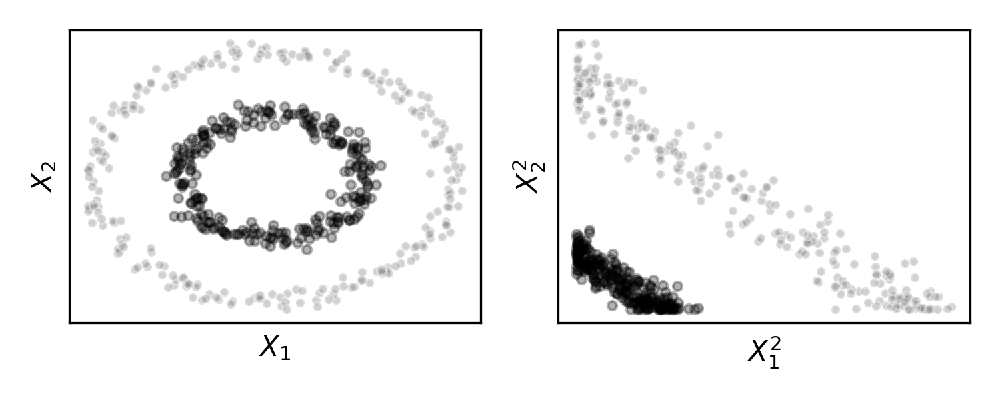
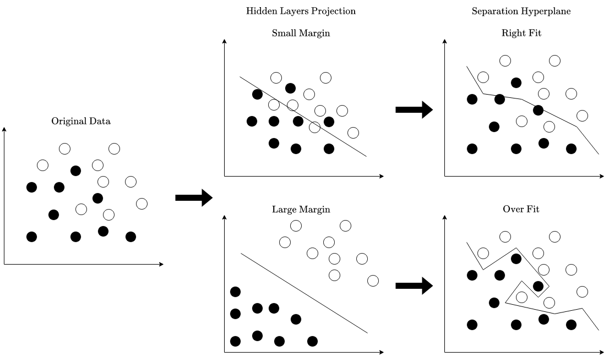
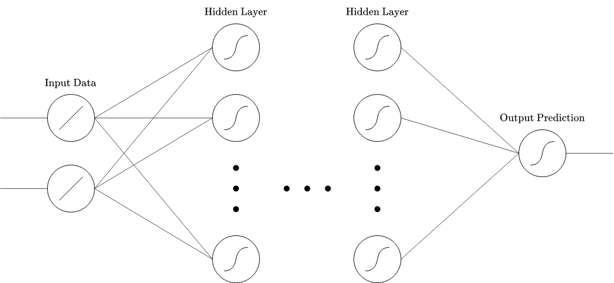
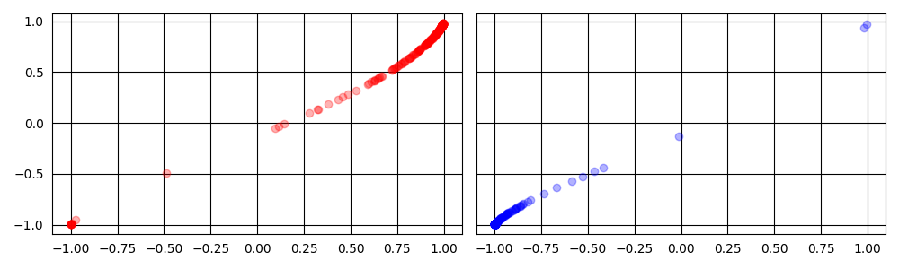
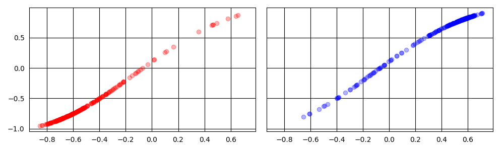

<!-- _class: title -->
<!-- _paginate: false -->

# Understanding class separability in the hidden layer projection of a binary classifier neural network in over-fitting situations

---

<!-- _class: title -->
<!-- _paginate: false -->

# Agenda

1. Context
1. Experiments
1. Results

---

<!-- _class: title -->
<!-- _paginate: false -->

# Context

----

<!-- _class: text -->

### Context
#### Motivation

- Representation learning with neural networks is an important topic nowadays
- Deep architectures are a great tool for representation learning

----

<!-- _class: text -->

### Context
#### Motivation

- Models that target only the objective metric are prone to over-fit

---

<!-- _class: text -->

### Context
#### Hypothesis

> **Large over-fit** effects lead to **large separability** between classes in the n-dimensional
**hidden-layer projection** space

---

<!-- _class: title -->
<!-- _paginate: false -->

# Experiments

---

<!-- _class: text -->

### Experiments
#### Model Architecture

- Over-fit induced Multi-layer Perceptron

 

---

<!-- _class: text -->

### Experiments
#### Metrics

## Separability

- Calinski-Harabasz Index
- Davies-Bouldin Index
- Silhouette Score
- Percentage of Negative Silhouette Observations
- Average Quality Index
- Percentage of Border Quality Observations

## Over-fit

- Regularization Parameter
- Train-test Accuracy Difference

---

<!-- _class: text -->

### Experiments
#### Metrics

## UCI Machine Learning Repository

- Statlog (Australian Credit Approval) Data Set
- Statlog (German Credit Data) Data Set
- Breast Cancer Coimbra Data Set
- Connectionist Bench (Sonar, Mines vs. Rocks) Data Set
- Statlog (Heart) Data Set

## Synthetic Data Sets

- Moons
- Linearly Separable Blobs
- XOR

---

<!-- _class: title -->
<!-- _paginate: false -->

# Results

---

<!-- _class: text -->

### Results
#### Expected

- By evaluating the Pearson Correlation between separability and over-fit metrics a certain behavior is expected based on the hypothesis

|              | Regularization | Accuracy Diff |
|--------------|:--------------:|:-------------:|
| CH Index     |        -       |       +       |
| DB Index     |        +       |       -       |
| Perc. Border |        +       |       -       |
| Avg Q Index  |        -       |       +       |
| Perc. NegSil |        +       |       -       |
| Sil Score    |        -       |       +       |

---

<!-- _class: text -->

### Results
#### Evaluation

| **Regularization Paremeter** | CH Index | DB Index | Perc. Border | Avg Q Index | Perc SilNeg | Sil Score |
|------------------------------|---------:|---------:|-------------:|------------:|------------:|----------:|
| breast coimbra               |   -0.595 |    0.766 |        0.712 |      -0.700 |       0.746 |    -0.695 |
| cred aus                     |   -0.049 |   -0.075 |        0.883 |      -0.870 |       0.855 |    -0.877 |
| cred ger                     |   -0.417 |   -0.149 |        0.812 |      -0.746 |       0.804 |    -0.752 |
| heart                        |   -0.687 |    0.933 |        0.913 |      -0.809 |       0.769 |    -0.874 |
| sonar                        |   -0.646 |    0.942 |        0.888 |      -0.916 |       0.917 |    -0.912 |
| xor                          |    0.447 |   -0.342 |        0.342 |      -0.345 |       0.556 |    -0.462 |
| blobs                        |   -0.083 |   -0.073 |        0.887 |      -0.884 |       0.826 |    -0.893 |
| moons                        |    0.345 |   -0.325 |        0.826 |      -0.789 |       0.808 |    -0.816 |

---

<!-- _class: text -->

### Results
#### Evaluation

| **Accuracy Difference** | CH Index | DB Index | Perc. Border | Avg Q Index | Perc SilNeg | Sil Score |
|-------------------------|---------:|---------:|-------------:|------------:|------------:|----------:|
| breast coimbra          |    0.861 |   -0.819 |       -0.846 |       0.884 |      -0.886 |     0.900 |
| cred aus                |    0.601 |   -0.133 |       -0.736 |       0.865 |      -0.702 |     0.832 |
| cred ger                |    0.799 |   -0.297 |       -0.879 |       0.978 |      -0.854 |     0.970 |
| heart                   |    0.860 |   -0.733 |       -0.689 |       0.898 |      -0.915 |     0.880 |
| sonar                   |    0.595 |   -0.765 |       -0.811 |       0.825 |      -0.816 |     0.820 |
| xor                     |   -0.629 |    0.604 |       -0.554 |       0.574 |      -0.564 |     0.250 |
| blobs                   |    0.015 |    0.080 |       -0.322 |       0.326 |      -0.302 |     0.319 |
| moons                   |   -0.379 |    0.229 |       -0.329 |       0.243 |      -0.303 |     0.242 |

---

<!-- _class: text -->

### Results
#### Visual Example

- Australian Credit Data Set
- Hidden Layer Sizes:
`256, 128, 64, 32, 16, 8, 2`
- Over-fit Model:
  - `reg_alpha=1e0`
  - Accuracy Difference: 10%
- Right-fit Model:
  - `reg_alpha=1e1`
  - Accuracy Difference: 5%

*Over-fit model hidden-layer projection*

 

*Right-fit model hidden-layer projection*

---

<!-- _class: text -->

### Results
#### Conclusion

- Valid confirmation of the **expected behavior**
- Certain metrics are **heavily influenced by convexity** of the clusters
- **Synthetic datasets** portray a harder challenge for the model to perform as expected
- The **relationship between the observations**, their **topology** and their **arrangement in the hidden-layer projection space** could motivate a **new methodology** for regularized neural network models

---

<!-- _class: title -->

# Gustavo Vieira Maia

 -  - 
