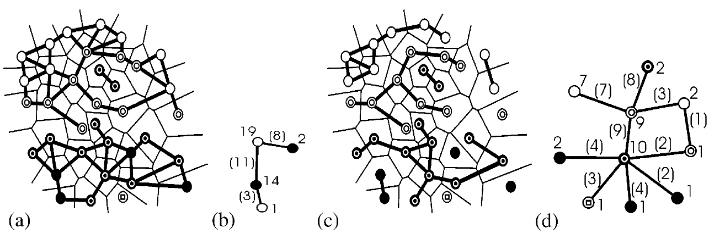

<!-- _class: title -->
<!-- _paginate: false -->

# High-dimensional labeled data analysis with topology representing graphs

---

<!-- _class: title -->
<!-- _paginate: false -->

# Agenda

1. Context
1. Framework
1. Graphs
1. Extract Graph Information
1. Experiments
1. Discussion

---

<!-- _class: title -->
<!-- _paginate: false -->

# Context

----

<!-- _class: text -->

### Context
#### Root Problem

Current exploratory data analysis strategies are **not capable** of handling **large high dimensional datasets**

 

- It is inefficient / inadequate to analyse isolated features
- Data projection into 2D or 3D distorts the information in a way that it becomes dificult to interpret the results

<!-- _footer: "By Nicoguaro - Own work, CC BY 4.0,   https://commons.wikimedia.org/w/index.php?curid=46871195" -->

----

<!-- _class: text -->

### Context
#### Objective

- What data are **close to the decision boundary**?
- **How complex** is this boundary?
- **How many components** a class is made of?
- **Which class is in contact** with each other?
- Is there **overlapping**?
- Is a **label coherent** with that of the remaining data?

---

<!-- _class: text -->

### Context
#### Premisse

> If the topology of the graph approximates the real topology of the high-dimensional data it is a good method to represent the information

---

<!-- _class: title -->
<!-- _paginate: false -->

# Framework

---

<!-- _class: text -->

### Framework
#### Definitions

- $\underline{v}$: finite set of $N$ data
- $\underline{v}$: a finite set of $C$ labels such that each datum $v_i \in \underline{v}$ has a class label $c(v_i) \in \underline{c}$ given by some classifier $c : E \rightarrow \underline{c}$
- $G(\underline{v}, \underline{l})$: undirected graph with $\underline{l}$ set of links between the data
- $N_{G(\underline{v}, \underline{l})}(v_i) = \{ v_j \in \underline{v} | l_{ij} \in \underline{l} \}$: denotes the neighbors of $v_i$ in $G$

---

<!-- _class: text -->

### Framework
#### Voronoï Cell

- Consists of all points of the plane **closer to that observation than to any other**
- This paper uses Euclidean Distance, but it may be calculated with different distance metrics

<!-- _footer: "By Balu Ertl - Own work, CC BY-SA 4.0,   https://commons.wikimedia.org/w/index.php?curid=38534275" -->

---

<!-- _class: text -->

### Framework
#### Delaunay Graph

- Connects with an edge any pair of points whose Voronoï cells **share a common boundary**, such that the edge crosses this boundary

<!-- _footer: "By Hferee - Own work, File:Delaunay_Voronoi.png (Nü es), Public Domain,   https://commons.wikimedia.org/w/index.php?curid=17061949" -->

---

<!-- _class: text -->

### Framework
#### Gabriel Graph

- If the **circle with diameter equal to the distance** between two observations **contains no other observation** then those are connected
- The Gabriel graph is a Delaunay subgraph, which contains the edges which are **not the longest edge** of any non-acute triangle.

<!-- _footer: "By Original: ALM scientist Vector: BethNaught - This file was derived from: Gabriel Pairs.JPG, Public Domain   https://commons.wikimedia.org/w/index.php?curid=42843896" -->

---

<!-- _class: text -->

### Framework
#### Comparison

- Delaunay Graphs becomes **untractable** for **high-dimensional data** because of its complexity
- Gabriel Graphs remain **accessible in high-dimensional** spaces as far as the size of the dataset remains reasonable

*Voronoï Diagram in light gray, Delaunay Graph in black, Gabriel Graph highlighted*

<!-- _footer: "Level Sets and Voronoi based Feature Extraction from any Imagery - Scientific Figure on ResearchGate. [accessed 26 Nov, 2022]   Available from: https://www.researchgate.net/figure/Gabriel-graph-highlighted-in-a-Delaunay-triangulation_fig2_256504154" -->

---

<!-- _class: title -->
<!-- _paginate: false -->

# Extract Graph Information

---

<!-- _class: text -->

### Extract Graph Information
#### Defining Topological Quality

 

$$
\forall v_i \in \underline{v}, q_i = 
\frac{
	| \{ v_j \in N_{G(\underline{v}, \underline{l})}(v_i) | c_j = c_i \} |
}{
	| {v_j \in N_{G(\underline{v}, \underline{l})}}(v_i) |
}
\in [0, 1]
$$

 

- The quality value ($q$) of a datum ($v_i$) is equal to the number of its neighbors ($N_{G(\underline{v}, \underline{l})}(v_i)$) with the same class ($c_j = c_i$) over the total number of neighbors.

**(a)** - **Normal**: all of its neighbors have the same label as its own
**(b)** - **Border**: at least one of its neighbors has a different label than its own
**(c)** - **Isolated**: all of its neighbors have a different label than its own

---

<!-- _class: text -->

### Extract Graph Information
#### Subgraphs

**(a)** - Original data with no links between classes;
**(b)** - Class graph;
**(c)** - Original data with no links between classes and no links between different quality names (normal, isolated, border) within each class;
**(d)** - Class-quality graph.

---

<!-- _class: text -->

### Extract Graph Information
#### Metrics

- **Diameter**
    The longest of its shortest paths in terms of number of edges between any pair of vertices
- **Depth**
    Shortest distance to the closest border datum of the same class
- **Decision Boundary Sampling**
    Instead of visualizing all of the data visualize only the border datum projected into 2D space

- **Overlap**
    Overlap means the convex hull of the classes overlap
- **Non-linear Separability Criterion**
    - no overlap $+$ single vertex per class in class-graph $\rightarrow$ linearly separable
    - overlap $+$ single vertex per class in class-graph $\rightarrow$ non-linearly separable
    - overlap $+$ several vertices per class in class-graph $\rightarrow$ non separable

---

<!-- _class: title -->
<!-- _paginate: false -->

# Experiments

---

<!-- _class: text -->

### Experiments
#### Datasets

## Iris

It describes the type of Iris plants based on sepal and petal features
- 150 observations
- 50 versicolor, 50 setosa and 50 virginica
- 4 attributes

## Seismic

It represents seismic activity from France since 1962 analysed by geophysical experts
- 2105 observations
- 1348 natural and 757 artificial events
- 5 attributes

---

<!-- _class: text -->

### Experiments
#### Results: Iris

**(a)** - Linear 2D projection shows **clear overlap** between classes Versicolor (circles) and Virginica (asterisk)
**(b)** - Non-linear 3D projection shows **no overlap**

 

**Contradictory conclusions** from the projections suggests that **using only projections** might not be a good strategy for exploratory analysis.

---

<!-- _class: text -->

### Experiments
#### Results: Iris

**(a)** - Class graph
**(b)** - Class-quality graph
**(c)** - Proposed representation of topological interactions between classes

---

<!-- _class: text -->

### Experiments
#### Results: Iris

- **No isolated** data in any class
- **Single conected component**
- **No overlap** despite what the 2 principal components projection shows
- St-Vs and St-Vg are **linearly separable** while Vs-Vg is **non-linearly separable**
- The **contact area** of the classes **vary significantly**
- There is a **single border component** in each class connected to both other classes

---

<!-- _class: text -->

### Experiments
#### Results: Seismic

- Linear projections are **misleading**
- The classification problem is **simpler** than the linear projection show

---

<!-- _class: text -->

### Experiments
#### Results: Seismic

- There are 2 distinct components and only 5 isolated data
- Some of the **isolated data** was later confirmed to be **mislabeled**

---

<!-- _class: title -->
<!-- _paginate: false -->

# Discussion

---

<!-- _class: text -->

### Discussion
#### Gabrie Graph $\times$ Delaunay Graph

- GG is the most complete subgraph of DG
- The **farther** the graph from the DG $\rightarrow$ **worse** the correspondence between the topology of the graph and the topology of the data $\rightarrow$ **lower** the relevance of the topological analysis
- With **increasing dimension** GG gets **close enough** to DG $\rightarrow$ GG becomes more useful than DG since DG is untractable in high dimensions

- The probability to get a non-acute triangle decreases exponentially with the dimension 
  $\rightarrow$ GG links all sides of non-acute triangle
  $\rightarrow$ The probability for the GG to be identical to the DG tends towards 1
  $\rightarrow$ Whenever the DG is not tractable, the GG provides a good approximation

---

<!-- _class: text -->

### Discussion
#### The curse of dimension

- In higher-dimensional spaces, all the points seems to be *equidistant* from each others
- Dimension between 10 and 50 is where the effects of the curse of dimension appear through the saturation effect

---

<!-- _class: text -->

### Discussion
#### Conclusion

- Topology representing graphs makes explicit the neighbohood relation between the data
- Exploring the topology of the data $\leftrightarrow$ exploring the topology of the graph
- Delaunay graph is the methodology which best preserves de topology of the classes related to the Nearest Neighbor classifier
- Gabriel Graph is a good aproximation of Delaunay Graph in high dimensional space
- The class-quality graph provides a summary visualization of the data topology

---

<!-- _class: title -->

# Gustavo Vieira Maia

 -  - 
